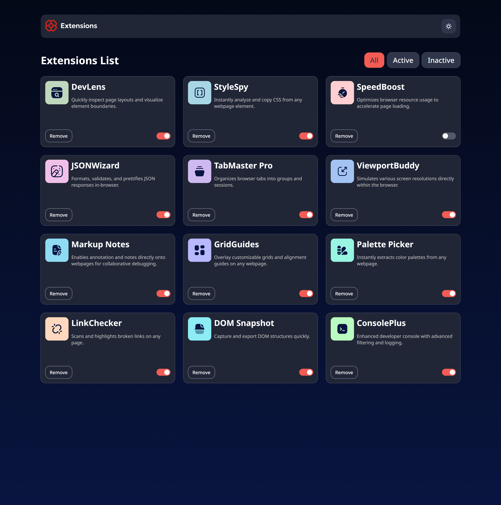

# Frontend Mentor - Browser extensions manager UI solution

Here's my attempt to build out out this browser extension manager.

## Overview

In this project, I didn't have the access for using figma-files, so my paddings, margins and so on aren't exact the same as inside the `/design` folder.

### The Challenge

Users should be able to:

1 - Toggle extensions between active and inactive states;
2 - Filter active and inactive extensions;
3 - Remove extensions from the list;
4 - Select their color theme;
5 - View the optimal layout for the interface depending on their device's screen size;
6 - See hover and focus states for all interactive elements on the page.

### Screenshot

### Links

- Vercel (https://browser-extensions-manager-ui-solution.vercel.app/)
- GitHub (https://github.com/PavAndrei/Browser-extensions-manager-UI-solution)

## My process

### Built with

- HTML
- CSS
- Flexbox
- Grid
- Responsive media queries
- JavaScript
- React library
- React Context API
- CSS modules

### What I learned

During this project, I significantly improved my front-end development skills. I solidified my knowledge of React components and state management, particularly through building reusable components like the filter buttons. I learned how to use the React Context API to manage the theme state effectively across the entire application, eliminating the need to prop drill. I gained valuable experience with Vite as a modern build tool, which drastically improved my development workflow compared to previous projects. Finally, I implemented modular CSS, which helped me organize my styling and avoid naming conflicts, resulting in a much more maintainable codebase.

### Continued development

I would like to learn more about making layouts more optimal for the different devices' screen sizes. Because it makes me a little bit puzzled during this challenge. Also, I'd like to work on React components, props, and state management and practiced building reusable and maintainable React components. I'm going to deeper understanding of React component lifecycles and how hooks can solve different issues.

### Useful resources

- (https://react.dev/)
- (https://react.dev/learn/passing-data-deeply-with-context)
- (https://dev.to/)

## Author

- https://github.com/PavAndrei/
